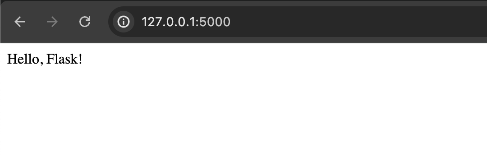
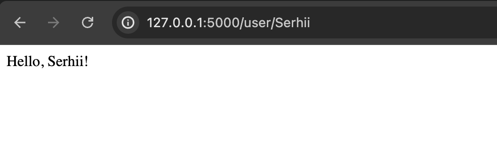

# Web development: домашние задание 1 (Python)

Задание 1

Найдите ошибку в коде:

```python
from flask import Flask

app = Flask(__name__)

@app.route('')

def home():
   return 'Hello, World!'

if __name__ == '__main__':
   app.run()
```

Ответ:
```python
from flask import Flask


app = Flask(__name__)


@app.route('/')  # URL rule было определено неверно
def home():
    return 'Hello, World!'


if __name__ == '__main__':
    app.run()
```

Задание 2

Создайте простое веб-приложение на Flask. Следуйте следующему алгоритму:
- Настройка проекта:
  
  - Создайте новый проект в PyCharm.
  - Настройте виртуальное окружение для проекта, используя либо встроенные средства IDE, либо командную строку (см. инструкции в лекции).
  - Активируйте виртуальное окружение и установите Flask с помощью pip.

- Создание базового Flask-приложения:
  - Создайте файл main.py.
  - Импортируйте необходимые модули (Flask).
  - Напишите код для создания экземпляра Flask-приложения.
  - Добавьте маршрут, который будет отвечать на корневой URL (/) и возвращать простое приветствие, например, "Hello, Flask!".

- Расширение функциональности:
  - Добавьте дополнительный маршрут /user/<name>, который будет возвращать приветственное сообщение с переданным именем..

- Запуск и тестирование приложения:
  - Запустите приложение убедитесь, что все маршруты работают корректно.
  - Приложите как решение ваш проект на гите и скриншоты с проверкой работы всех маршрутов.

```python
from flask import Flask


app = Flask(__name__)


@app.route('/')
def home():
    return 'Hello, Flask!'


@app.route('/user/<username>')
def hello(username):
    return f'Hello, {username.capitalize()}!'


if __name__ == '__main__':
    app.run(debug=True)
```



